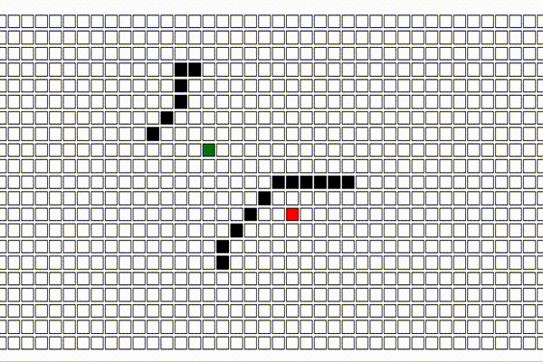

# [Typed Pathfinder]()

------

### Tech Stack

* TypeScript
* React

------

This is a Pathfinding visualizer. As someone that has always appreciated visual learning, I wanted to create something that would be useful to myself and hopefully others. The goal of this project is to create a sandbox for showcasing how different pathfinding algorithms run, and in terms of coding practices, this project is meant to emphasize the importance of data typing, and highly modular components. Currently, there is work to be done on both practices.

------


Demo of BFS visualization.

------

### How to Use

------

Simply select an algorithm, move the start/end as you please, put blockers if you want, and click RUN.


### How it Works

------

* Typed pathfinder is a project that is based on react state. It uses componenent state in order to create animations, based on a grid of stateful nodes.

------


### Example Code

------

An example of...
```js
```

An example of...
```js
```

